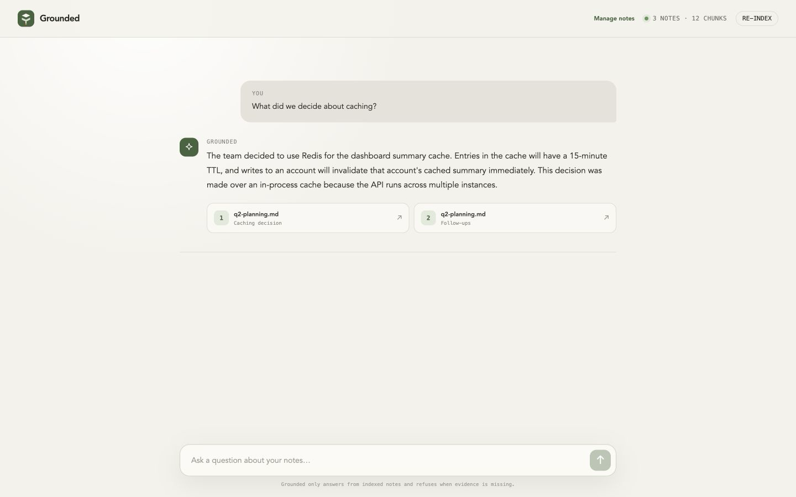
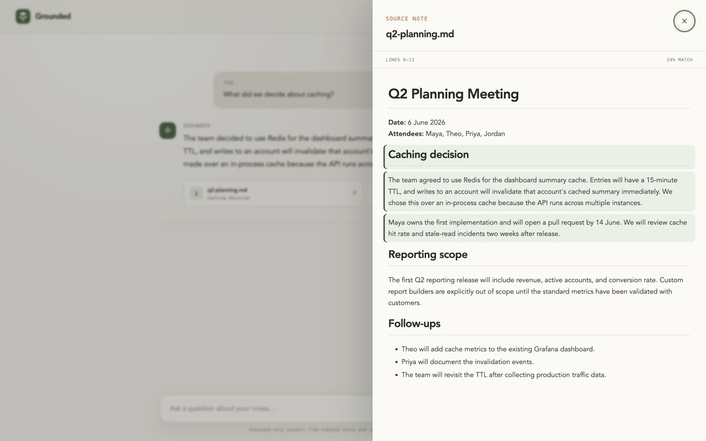
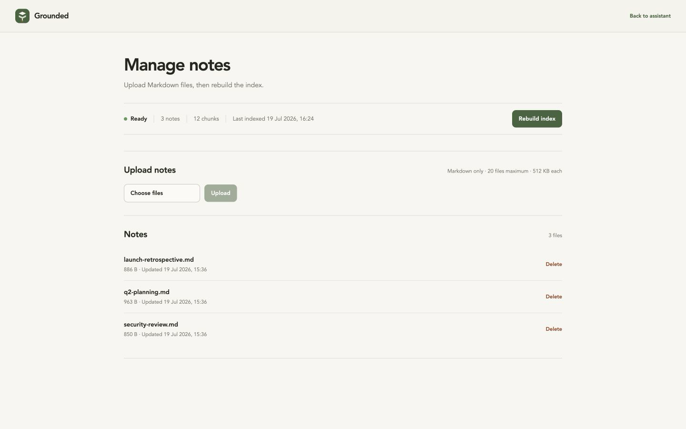
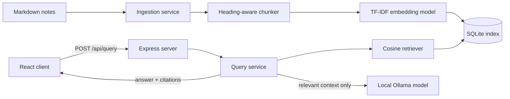

<div align="center">
  

  # Grounded

  **A local-first Notes Q&A Assistant with grounded answers and inspectable citations.**

  Ask questions across Markdown notes, get concise answers from a local model, and open every citation at the exact supporting section.

  [](https://nodejs.org/)
  [](https://react.dev/)
  [](https://expressjs.com/)
  [](#testing-and-evaluation)
  [](#evaluation-results)
  [](#overview)
</div>



## Table of contents

- [Overview](#overview)
- [Screenshots](#screenshots)
- [Features](#features)
- [Architecture](#architecture)
- [Quick start](#quick-start)
- [Usage](#usage)
- [Configuration](#configuration)
- [API](#api)
- [Retrieval and refusal](#retrieval-and-refusal)
- [Grounding prompt](#grounding-prompt)
- [Testing and evaluation](#testing-and-evaluation)
- [Project structure](#project-structure)
- [Requirements coverage](#requirements-coverage)
- [Current trade-offs](#current-trade-offs)
- [What I'd do with more time](#what-id-do-with-more-time)

## Overview

Grounded is a small internal knowledge tool for Markdown notes. It recursively ingests a notes directory, creates Markdown-aware chunks, builds local TF-IDF embeddings, and stores the complete index in SQLite. Questions are ranked with cosine similarity before relevant context is sent to a local Ollama model.

The application is intentionally self-contained:

- **One server:** Express serves the JSON API and the React application.
- **Local retrieval:** TF-IDF embeddings and cosine similarity run in-process.
- **Local storage:** notes, chunks, vectors, and index metadata live in SQLite.
- **Local generation:** Ollama runs `qwen2.5:3b` on the user's machine.
- **No paid services:** there are no API keys, hosted databases, or per-request costs.
- **No orchestration frameworks:** the retrieval and grounding pipeline is implemented directly without LangChain or LlamaIndex.

> [!IMPORTANT]
> Grounded refuses unsupported questions before calling Ollama. The model never receives a question when retrieval finds no chunk at or above the configured similarity threshold.

## Screenshots

### Rendered source citations

Citation cards open the original note in a keyboard-accessible side panel. Markdown is rendered as a structured document, and every block overlapping the cited line range is highlighted.



### Bonus (optional): Lightweight internal admin page

The optional `/admin` page is a small internal tool for managing Markdown notes. Uploading, replacing, or deleting a top-level Markdown file automatically rebuilds the same shared index used by the assistant.



## Features

| Area | Capability |
| --- | --- |
| 🔎 Retrieval | TF-IDF unigram and bigram embeddings with cosine ranking and source-diverse context selection |
| 🧱 Ingestion | Recursive Markdown discovery, heading-aware chunks, overlap, and source line tracking |
| 🛡️ Grounding | Threshold refusal before generation plus a strict notes-only system prompt |
| 🔗 Citations | Referenced sources only, with filename, heading, snippet, score, and line range |
| 📖 Markdown rendering | Structured headings, lists, tables, code, alerts, links, badges, and images in answers and source notes |
| ✨ Quality of life | Small built-in replies for common conversational messages without invoking the RAG pipeline |
| 🗃️ Persistence | Transactional SQLite replacement prevents partially published indexes |
| 🧰 Bonus *(optional)* | Lightweight internal admin page for managing Markdown notes |
| ⌨️ Accessibility | Semantic controls, focus restoration, dialog focus trapping, Escape handling, and reduced-motion support |
| 📱 Responsive UI | Assistant, citation panel, and admin page adapt cleanly to mobile layouts |
| 🧪 Verification | Unit, integration, API, security, parser, and deterministic evaluation coverage |

## Architecture



### How a question is answered

1. The API normalizes and validates the message.
2. Exact conversational intents return a built-in response before any database or model work.
3. Actual note questions are embedded with the same saved TF-IDF vocabulary used during ingestion.
4. Cosine similarity ranks indexed chunks and removes candidates below `SIMILARITY_THRESHOLD`.
5. If no chunk survives, the API returns the refusal immediately and does **not** call Ollama.
6. Otherwise, the relevant excerpts and exact grounding prompt are sent to Ollama, and the API returns the answer with source metadata.

## Quick start

The following setup works on a fresh machine and keeps the complete project local.

### Prerequisites

- [Node.js](https://nodejs.org/) `20.19` or newer
- npm, included with Node.js
- [Ollama](https://ollama.com/) installed locally
- Enough disk space and memory for `qwen2.5:3b`

### 1. Clone and install

```bash
git clone https://github.com/Suraj1812/grounded-notes-qa-assistant.git
cd grounded-notes-qa-assistant
npm ci
```

### 2. Download the local model

```bash
ollama pull qwen2.5:3b
```

If Ollama is not already running as a desktop service, start it in a separate terminal:

```bash
ollama serve
```

### 3. Start Grounded

```bash
npm run dev
```

Open:

- Assistant: [http://localhost:3000](http://localhost:3000)
- Note management: [http://localhost:3000/admin](http://localhost:3000/admin)

The first startup automatically indexes `fixtures/notes` when the local database is empty.

> [!TIP]
> Copy `.env.example` to `.env` only when you want to override a default. No environment file is required for the included fixtures.

### Production-style run

```bash
npm run build
npm start
```

`npm start` rebuilds the index and then serves the compiled React application and API through the same Express process.

## Usage

Try one of the included questions:

```text
What did we decide about caching?
How will team members sign in?
Why was the launch date moved?
```

Try an unsupported question to verify refusal behavior:

```text
What is the office lunch menu on Fridays?
```

Grounded responds:

```text
I don't have information about that in the notes.
```

### Small UX improvement: built-in conversation

As a small quality-of-life improvement, common greetings, thanks, farewells, acknowledgements, and help requests receive short fixed responses. These messages bypass SQLite, retrieval, and Ollama; note-related questions continue through the normal RAG flow.

### Rebuilding the index

Use any one of these paths:

```bash
npm run ingest
```

- Select **Re-index** in the assistant header.
- Select **Rebuild index** on the admin page.
- Send `POST /api/ingest`.

The assistant header automatically synchronizes index state and note/chunk counts in the background. It also refreshes immediately when the tab regains focus, so Admin uploads, deletions, and rebuilds appear without reloading the page. **Re-index** remains available as a manual fallback.

Ingestion recursively reads `.md` files, normalizes line endings, splits content at Markdown headings and readable boundaries, fits one embedding model across the corpus, and writes the new index in a single SQLite transaction.

### Bonus (optional): Managing notes

The internal admin page can:

- upload one or more Markdown files;
- replace an existing file with the same filename;
- delete managed files;
- automatically rebuild the index after any file change;
- manually rebuild the index whenever needed;
- show note count, chunk count, index state, and last indexed time.

Uploads accept top-level `.md` filenames only: 20 files per request, 512 KB per file, and 2 MB combined. Both client and server validate limits, while the server remains authoritative. Directory traversal, path separators, control characters, hidden filenames, and non-Markdown extensions are rejected. Successful uploads, replacements, and deletions immediately start a background index rebuild.

## Configuration

All settings are optional.

| Variable | Default | Purpose |
| --- | --- | --- |
| `PORT` | `3000` | HTTP port for the single Express server |
| `NOTES_DIR` | `./fixtures/notes` | Markdown knowledge-base directory |
| `DATABASE_PATH` | `./data/notes.db` | SQLite index path |
| `SIMILARITY_THRESHOLD` | `0.12` | Minimum TF-IDF relevance score allowed into model context |
| `MAX_CONTEXT_CHUNKS` | `3` | Maximum retrieved chunks supplied to Ollama |
| `OLLAMA_BASE_URL` | `http://127.0.0.1:11434` | Local Ollama endpoint |
| `OLLAMA_MODEL` | `qwen2.5:3b` | Generation model |
| `OLLAMA_TIMEOUT_MS` | `90000` | Model request timeout in milliseconds |

Relative note and database paths are resolved from the project root, so commands behave consistently regardless of the current shell directory.

## API

| Method | Endpoint | Success | Purpose |
| --- | --- | ---: | --- |
| `GET` | `/api/health` | `200` | Return readiness, index state, counts, model, and last indexed time |
| `POST` | `/api/query` | `200` | Return a grounded answer and citations |
| `POST` | `/api/ingest` | `200` | Rebuild the index and wait for completion |
| `GET` | `/api/notes/*filename` | `200` | Return an indexed source note, including nested paths |
| `GET` | `/api/admin` | `200` | Return editable files and index status |
| `POST` | `/api/admin/notes` | `201` | Upload or replace Markdown files |
| `DELETE` | `/api/admin/notes/:filename` | `200` | Delete a managed Markdown file |
| `POST` | `/api/admin/index` | `202` | Start an asynchronous index rebuild |

### Query example

```http
POST /api/query
Content-Type: application/json
```

```json
{
  "question": "What did we decide about caching?"
}
```

```json
{
  "answer": "We chose Redis with a 15-minute TTL [1].",
  "citations": [
    {
      "filename": "q2-planning.md",
      "heading": "Caching decision",
      "snippet": "The team agreed to use Redis for the dashboard summary cache…",
      "score": 0.42,
      "startLine": 6,
      "endLine": 10
    }
  ],
  "refused": false
}
```

Note questions are normalized and must contain between 3 and 500 characters. Supported short conversational intents such as `hi` and `ok` are handled before that length check. The API returns consistent JSON errors without stack traces:

| Status | Example condition |
| ---: | --- |
| `400` | Invalid question, unsafe path, malformed JSON, or invalid upload |
| `404` | Missing note or unknown API route |
| `409` | Another index rebuild is already running |
| `413` | Request or upload limit exceeded |
| `503` | Empty index or unavailable Ollama service |
| `504` | Ollama request timeout |

## Retrieval and refusal

### Chunking

The chunker preserves the closest Markdown heading, source line range, and configurable character overlap. It prefers paragraph breaks, then line breaks, then whitespace, rather than cutting text blindly at a fixed offset. Stable chunk IDs are derived from the filename, chunk index, and content.

### Local embeddings

Grounded tokenizes Unicode text, removes a compact stop-word list, normalizes common English inflections, and adds bigrams. TF-IDF vectors are L2-normalized before storage and comparison. The fitted vocabulary and inverse-document-frequency values are saved with the index so queries use the exact same model. Chunk content and its closest Markdown heading are scored independently, with concise heading matches receiving extra ranking weight so they are not diluted by a long section.

After thresholding, context selection gives the strongest matching chunk from each relevant file a slot before filling any remaining slots from the same file. This prevents examples in one large document from crowding the actual supporting note out of the model context while preserving multi-section recall when only one file matches.

### Why the threshold is `0.12`

The default cosine-derived relevance threshold was selected against the checked-in evaluation set. It retains all five answerable cases while rejecting all three unrelated cases. A relatively low threshold is appropriate for sparse TF-IDF vectors because a relevant question may share only a few weighted terms with its source chunk.

This value is deliberately configurable. A real organization should tune it on a larger labeled dataset with precision, recall, and refusal-rate analysis instead of treating `0.12` as universal.

### Two refusal guards

1. **Retrieval guard:** if no chunk scores at or above the threshold, the service returns the public refusal without calling Ollama.
2. **Generation guard:** if Ollama still responds with “I don't know,” the service normalizes it to the same public refusal and removes citations.

## Grounding prompt

The exact system prompt is exported from [`src/server/prompts/grounded-prompt.ts`](src/server/prompts/grounded-prompt.ts):

```text
You are a careful internal notes assistant.

Answer the user's question using ONLY the note excerpts supplied in <sources>.
- Do not use outside knowledge or make assumptions.
- Cite each factual claim with the matching source number in square brackets, for example [1].
- When several notes contribute, cite each relevant source.
- Prefer excerpts with direct factual statements over excerpts that only repeat the question, explain app usage, or show sample API responses.
- If the excerpts do not contain enough information to answer, reply exactly: "I don't know based on the provided notes."
- Respond with the direct natural-language answer. Do not reproduce JSON, API response examples, or code fences unless the user explicitly asks for them.
- Keep the answer concise and useful. Do not add a separate sources list.
```

The user prompt is assembled in this exact shape:

```text
<sources>
[1] filename.md — Section heading
Relevant note excerpt

[2] another-note.md — Another section
Relevant note excerpt
</sources>

Question: <the user's question>
```

The retrieval threshold is the primary hallucination boundary; the prompt is a second boundary for context that is related but insufficient.

## Testing and evaluation

Run the complete verification pipeline:

```bash
npm run check
```

Or run each stage separately:

```bash
npm test
npm run build
npm run evaluate
```

| Suite | Coverage |
| --- | --- |
| Chunker | Empty files, long files, overlap, headings, CRLF, Unicode, emoji, and unusual formatting |
| Retrieval | Checked-in three-note fixture, correct ranking, absent vocabulary, similarity scores, and source diversity |
| Query service | Threshold refusal, skipped model calls, model uncertainty, answers, and referenced-only citations |
| Conversation guard | Every supported greeting, farewell, thanks, acknowledgement, and help phrase plus normalization and non-interception |
| Ollama client | Connection failures, safe errors, and timeouts |
| API integration | Validation, sanitation, malformed JSON, empty indexes, nested sources, traversal, status codes, and ingestion failures |
| Admin API | Listing, replacement, upload limits, unsafe filenames, deletion, metadata, and shared-pipeline rebuilding |
| Markdown reader | Headings, tables, code fences, alerts, lists, tasks, HTML layout wrappers, linked badges, images, citations, and hard line breaks |

### Evaluation results

The deterministic evaluation copies only the three intended checked-in fixture notes into an isolated temporary corpus, then runs real ingestion, embedding, retrieval, thresholding, citation selection, and refusal. Admin uploads therefore cannot alter evaluation results. A fixed answer generator keeps the run offline and isolates retrieval quality from local model latency and wording variation.

| # | Question | Expected | Result |
| ---: | --- | --- | :---: |
| 1 | What did we decide about caching? | `q2-planning.md` | ✅ Pass |
| 2 | How long do cached dashboard summaries live? | `q2-planning.md` | ✅ Pass |
| 3 | How do employees sign in? | `security-review.md` | ✅ Pass |
| 4 | How long are audit logs retained? | `security-review.md` | ✅ Pass |
| 5 | Why did the pilot launch move to 15 July? | `launch-retrospective.md` | ✅ Pass |
| 6 | What is the office lunch menu on Fridays? | Refuse | ✅ Pass |
| 7 | Who won the company football tournament? | Refuse | ✅ Pass |
| 8 | What color is the new company logo? | Refuse | ✅ Pass |

**Latest verified result: 8/8 passed.** The complete generated output is checked in at [`evaluation-results.txt`](evaluation-results.txt).

This evaluation measures retrieval, citation selection, and refusal behavior. It intentionally does not claim to measure the prose quality of a particular Ollama model.

## Project structure

```text
grounded-notes-qa-assistant/
├── docs/screenshots/            Real application screenshots used in this README
├── fixtures/notes/              Sample Markdown knowledge base
├── scripts/
│   ├── evaluate.ts              Deterministic eight-case evaluation
│   └── ingest.ts                Command-line index rebuild
├── src/
│   ├── client/
│   │   ├── components/          Focused assistant, Markdown, and admin components
│   │   ├── hooks/               Health, source, scrolling, and admin state
│   │   ├── markdown/            Safe Markdown block parser with source-line tracking
│   │   ├── pages/               Assistant, admin, and not-found pages
│   │   └── services/            Typed browser API clients
│   ├── server/
│   │   ├── config/              Environment configuration
│   │   ├── controllers/         HTTP request handlers
│   │   ├── database/            SQLite persistence
│   │   ├── middleware/          Consistent error handling
│   │   ├── prompts/             Exact grounded system prompt
│   │   ├── retrieval/           Chunking, TF-IDF embeddings, and ranking
│   │   ├── routes/              Assistant and admin API routes
│   │   ├── services/            Ingestion, indexing, Ollama, files, and queries
│   │   ├── types/               Server domain types
│   │   └── validation/          Questions, source paths, and uploads
│   └── shared/                  API types, limits, and built-in conversational intents
└── tests/                       Unit and API integration tests plus tiny fixtures
```

## Requirements coverage

| Assignment requirement | Implementation |
| --- | --- |
| Single question-in, answer-out chat page | React assistant at `/` |
| Loading state | Animated, accessible “Reading your notes” state |
| Last 10 question-answer pairs visible | In-memory history capped at 10 exchanges |
| Clickable citations with source content | Citation cards and inline markers open the source dialog |
| One HTTP server | Express serves API plus Vite middleware or production static files |
| Ingest `fixtures/notes` | Startup, CLI, assistant, admin, and API rebuild paths share one ingestion service |
| Chunk, embed, and store locally | Markdown chunker, local TF-IDF vectors, and SQLite |
| `POST /query` equivalent | `POST /api/query` returns answer, citations, and refusal state |
| Explicit unsupported-answer behavior | Threshold guard returns the required refusal without an LLM call |
| Exact prompt documented | System and assembled user prompt are included above |
| Required chunker tests | Empty, very long, and unusual/Unicode cases covered |
| Retrieval fixture tests | Three tiny checked-in notes exercised directly |
| Eight-case evaluation | Five answerable and three unanswerable cases with per-check output |
| Most recent evaluation output | Generated `evaluation-results.txt` checked in |
| Highlight cited section *(stretch)* | Source-line-aware Markdown blocks are highlighted and scrolled into view |
| Multiple contributing sources *(stretch)* | Up to three relevant citations are returned and displayed |
| Streaming *(optional stretch)* | Not implemented; the UI provides a complete loading state instead |
| Internal admin *(bonus)* | Minimal Markdown-only management at `/admin`, with no added framework or authentication |

## Current trade-offs

- TF-IDF is transparent, inexpensive, and offline, but it is weaker than semantic embeddings for synonyms and broad paraphrases.
- The `0.12` threshold is calibrated on eight fixture questions rather than a large representative corpus.
- Answer quality and latency depend on the local Ollama model and available machine resources.
- Re-indexing intentionally rebuilds the complete corpus instead of incrementally updating changed files.
- The admin page has no authentication by design and is appropriate only for a trusted local or internal environment.
- Conversation history is memory-only and clears on reload, matching the assignment scope.

## What I'd do with more time

- Build a larger labeled evaluation set and tune the threshold with precision, recall, and refusal-rate reporting.
- Compare a compact local semantic embedding model against TF-IDF while preserving an offline fallback.
- Add content hashes and index versioning so unchanged notes can be skipped during incremental ingestion.
- Stream Ollama output with request cancellation while preserving citation validation before display.

## License

This project was developed as part of a Full Stack Developer take-home assessment.
